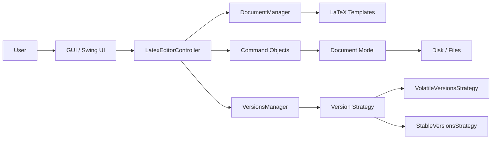

# LaTeX Editor

[](https://github.com/ChristosGoulas/Latex-Editor/actions/workflows/ci.yml)
[](LICENSE)
[](https://www.oracle.com/java/)
[](https://gradle.org/)

A Java Swing desktop application for creating, editing, and versioning LaTeX documents using template-based workflows and command-driven document management.

## Project Summary

This project was developed as a personal Java desktop application and later modernized into a Gradle-based project suitable for modern IDEs and CI pipelines. It demonstrates classic object-oriented design in a practical editor context, combining UI workflows with document lifecycle logic and version tracking.

The application is designed to help users create LaTeX documents without manually remembering command syntax for common document structures. It focuses on template generation, command insertion, persistence, and document history management.

## Why This Project Is Interesting to Engineering Managers

This project is more than a basic text editor. It showcases several core software engineering qualities:

- Object-oriented design and modularity
- Separation of concerns across UI, controller, and document layers
- Command-based interaction model
- Strategy pattern for version storage behavior
- Test-driven validation with JUnit
- CI-ready project structure for automated quality checks
- Modern build tooling with Gradle and resource management

## Key Features

- Create new LaTeX documents from template options
  - Report
  - Book
  - Article
  - Letter
  - Empty document
- Edit LaTeX content within a Swing desktop GUI
- Insert common LaTeX commands via menu-driven interactions
- Save and load document files
- Enable and disable version tracking
- Switch between version storage strategies
  - Volatile in-memory tracking
  - Stable persistent storage
- Roll back to previous document versions
- Run with a modern Java toolchain and Gradle wrapper

## System Architecture



## Architecture and Design Patterns

This project applies several design patterns commonly emphasized in software engineering interviews and code reviews:

- Prototype: document cloning for template-based creation
- Strategy: selective version history storage strategies
- Factory: creation of commands and strategy objects
- Command: encapsulated actions for document editing and version control

## Tech Stack

- Java 17+
- Swing/AWT
- Gradle
- JUnit 5
- JaCoCo for test coverage
- GitHub Actions CI

## Project Structure

```text
Latex-Editor/
├── .github/
│   └── workflows/
│       └── ci.yml
├── src/
│   ├── GUI/
│   │   └── LatexEditorView.java
│   ├── latexData/
│   │   ├── Command.java
│   │   ├── Document.java
│   │   ├── DocumentManager.java
│   │   ├── VersionsManager.java
│   │   ├── VersionsStrategy.java
│   │   ├── StableVersionsStrategy.java
│   │   ├── VolatileVersionsStrategy.java
│   │   └── ...
│   ├── latexTest/
│   │   └── ...
│   └── resources/
│       ├── icons/
│       ├── tex/
│       └── txt/
├── build.gradle
├── gradlew
├── gradlew.bat
├── settings.gradle
├── README.md
├── LICENSE
└── .gitignore
```

## Getting Started

### Prerequisites

- JDK 17+
- IntelliJ IDEA or another Java IDE
- Git installed

### Run it locally

From the project root:

```bash
./gradlew run
```

Or open the project in IntelliJ IDEA and run the main class:

```text
GUI.LatexEditorView
```

### Run the test suite

```bash
./gradlew test
```

### Generate coverage report (JDK 17 recommended)

```bash
./gradlew jacocoTestReport
```

The HTML report will be generated under:

```text
build/reports/jacoco/test/html/
```

## Test Coverage and Quality

This project includes JaCoCo integration to measure how much of the code is exercised by automated tests when running on a compatible Java version (JDK 17 is recommended). JaCoCo is especially valuable in portfolio and professional projects because it demonstrates:

- test discipline
- measurable code quality
- confidence in refactoring
- maturity beyond “it compiles”

## Engineering Highlights

- Modernized legacy Java project for current IDEs and build tooling
- Added CI automation for pull requests and pushes
- Added automated test coverage reporting
- Preserved the original educational design goals while improving maintainability
- Built around realistic software engineering principles rather than a one-off script

## References

- LaTeX Project: https://www.latex-project.org/
- MiKTeX: https://miktex.org/
- LaTeX/Document Structure: https://en.wikibooks.org/wiki/LaTeX/Document_Structure

## License

This project is licensed under the MIT License. See the LICENSE file for details.


